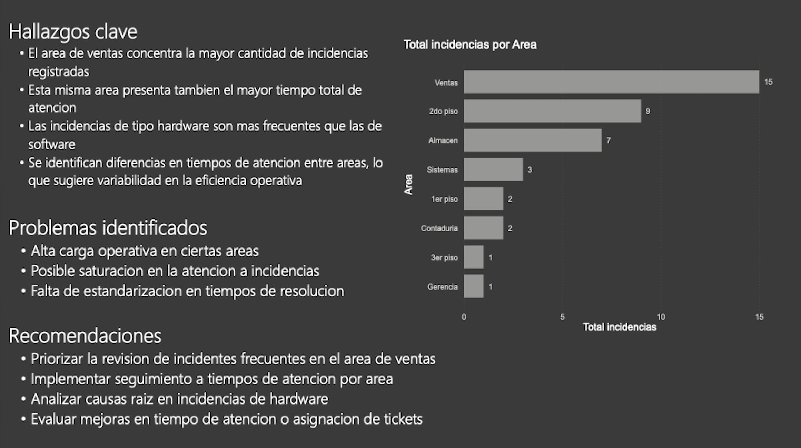

# Proyecto de Análisis de Incidencias

Este proyecto analiza incidencias del área de sistemas con el objetivo de identificar patrones y generar recomendaciones para mejorar el soporte técnico.

---

## Herramientas utilizadas

- Excel (limpieza de datos)
- SQL (exploración)
- Power BI (visualización)

---

## SQL Queries destacadas

### Top 5 problemas más comunes

```sql
SELECT 
    tipo_problema,
    COUNT(tipo_problema) AS total
FROM eventos
GROUP BY tipo_problema
ORDER BY total DESC 
LIMIT 5;
```

Identifica los cinco tipos de problemas más frecuentes, permitiendo priorizar acciones de mejora en los incidentes más recurrentes.

---

### Tiempo promedio de resolución por categoría

```sql
SELECT 
    categoria,
    COUNT(*) AS total_casos,
    ROUND(AVG(tiempo_resolucion), 2) AS promedio_resolucion
FROM eventos
GROUP BY categoria
ORDER BY promedio_resolucion DESC;
```

Calcula el tiempo promedio de resolución por categoría junto con el volumen de casos, facilitando la detección de áreas con mayor complejidad operativa.

---

### Incidencias por área

```sql
SELECT 
    area,
    COUNT(*) AS total_incidencias
FROM eventos
GROUP BY area
ORDER BY total_incidencias DESC;
```

Muestra la cantidad de incidencias por área, ayudando a identificar qué departamentos concentran mayor carga de trabajo o presentan más problemas.

---

## Dashboard

El dashboard fue estructurado en tres niveles:

- Resumen ejecutivo
- Análisis detallado
- Insights y recomendaciones

Incluye:
- KPIs principales
- Incidencias por área y tipo
- Tendencia en el tiempo
- Tiempo de resolución

---

## Insights clave

- Alta recurrencia en incidencias relacionadas con impresoras
- Mayor carga operativa en áreas específicas
- Diferencias en tiempos de atención entre áreas

---

## Archivos del proyecto

- Dataset limpio
- Dashboard en Power BI (.pbix)
- Documentación del análisis

## Dashboard

### Página 1


### Página 2


### Página 3


### 📥 Descargar completo
[Descargar PDF](./5_dashboard_export/dashboard.pdf)
