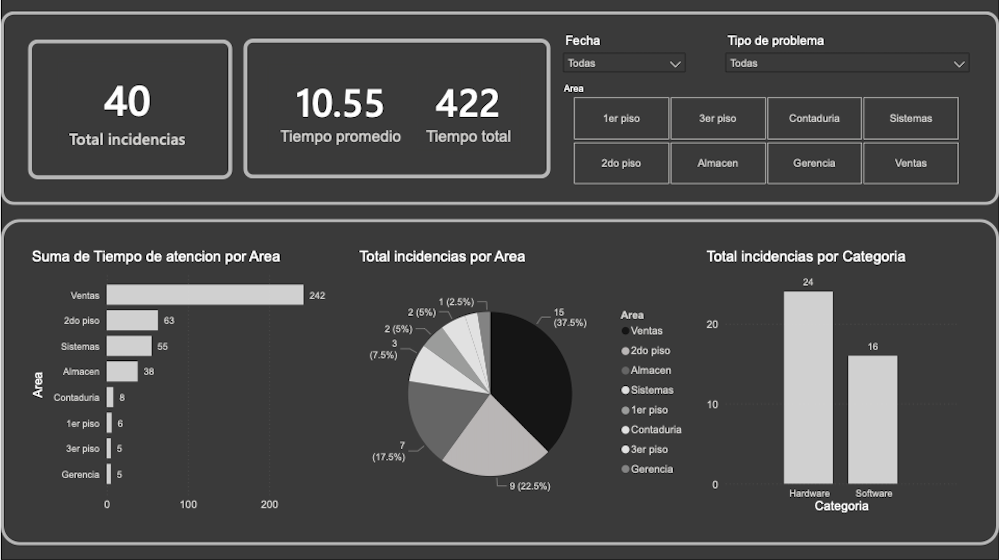
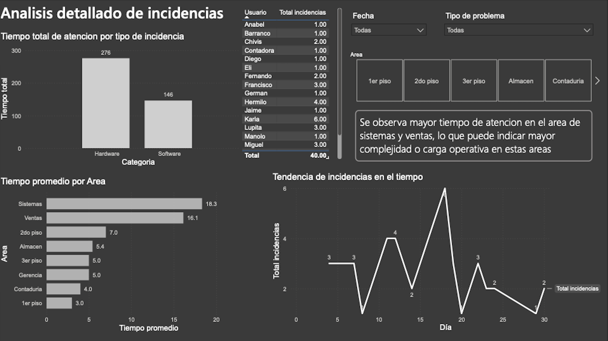

# Proyecto de Análisis de Incidencias

Este proyecto analiza incidencias del área de sistemas con el objetivo de identificar patrones y generar recomendaciones para mejorar el soporte técnico.

---

## Herramientas utilizadas

- Excel (limpieza de datos)
- SQL (exploración)
- Power BI (visualización)

---

## Dashboard

El dashboard fue estructurado en tres niveles:

- Resumen ejecutivo
- Análisis detallado
- Insights y recomendaciones

Incluye:
- KPIs principales
- Incidencias por área y tipo
- Tendencia en el tiempo
- Tiempo de resolución

---

## Insights clave

- Alta recurrencia en incidencias relacionadas con impresoras
- Mayor carga operativa en áreas específicas
- Diferencias en tiempos de atención entre áreas

---

## Archivos del proyecto

- Dataset limpio
- Dashboard en Power BI (.pbix)
- Documentación del análisis

## Dashboard

### Página 1

### Página 2

### Página 3

### 📥 Descargar completo
[Descargar PDF](dashboard.pdf)
